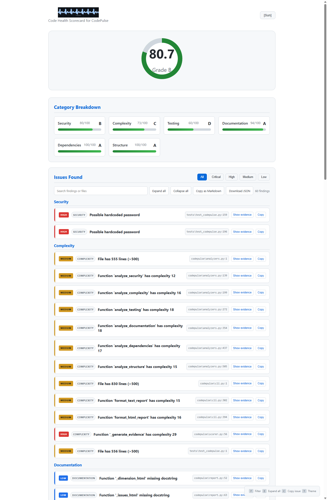

<p align="center">
  
</p>

<h1 align="center">CodePulse</h1>

<p align="center">
  <strong>Know your code's health in 30 seconds.</strong>
</p>

<p align="center">
  <a href="https://github.com/DannyBaanks/CodePulse/actions/workflows/ci.yml?query=branch%3Amaster"></a>
  <a href="https://pypi.org/project/codepulse/"></a>
  <a href="https://pypi.org/project/codepulse/"></a>
  <a href="https://github.com/DannyBaanks/CodePulse/blob/master/LICENSE"></a>
  <a href="https://github.com/DannyBaanks/CodePulse/stargazers"></a>
  <a href="https://github.com/DannyBaanks/CodePulse/issues"></a>
</p>

CodePulse is a deterministic Python static-analysis scorecard with optional AI prioritization. It shows **exactly why** each score exists with specific findings, file locations, and actionable fixes.

> **Built for the AI Builders Hackathon 2026** — Evidence before narrative. Never guess.

---

## 🚀 Quick Start

```bash
# Install from source
pip install -e .

# Scan current directory (text output with ANSI colors)
codepulse

# Scan a specific path
codepulse /path/to/project

# Generate beautiful HTML report
codepulse --format html --output report.html

# JSON output for CI/CD pipelines
codepulse --json

# Skip AI insights (faster, zero external deps)
codepulse --no-ai

# Compare two commits (see what changed!)
codepulse diff HEAD~1 HEAD
```

---

## 📊 Example Output

### Text (ANSI Colored)

```
═══════════════════════════════════════════════════
  CODEPULSE - Code Health Scorecard
═══════════════════════════════════════════════════

  Overall Score:  82/100
  Grade:          B

  Category Breakdown:
    Security       ###########--------- 55/100 (F)
    Complexity     ###############----- 77/100 (B)
    Testing        ##################-- 90/100 (A)
    Documentation  #################### 100/100 (A)
    Dependencies   #################### 100/100 (A)
    Structure      #################### 100/100 (A)

  Why these scores?
    Security:
      [-] Security is poor (55/100)
        3 critical issue(s) found
        Hardcoded credential: tests/test_analyzers.py:11
        Hardcoded credential: tests/test_codepulse.py:162
    Complexity:
      [~] Complexity needs improvement (77/100)
        1 high-severity issue(s)
        10 medium-severity issue(s)
        Function 'analyze_testing' has complexity 23 at codepulse/analyzers.py:259
    Testing:
      [+] Testing is excellent (90/100)
    ...

  Issues Found (14):
    Security:
      CRIT Possible hardcoded password  tests/test_analyzers.py:11
      CRIT Possible hardcoded password  tests/test_codepulse.py:162
    Complexity:
      HIGH Function 'analyze_testing' has complexity 23
      MED  Function 'analyze_security' has complexity 12
    ...
```

### Interactive HTML Report

**[Open the live interactive demo](https://htmlpreview.github.io/?https://github.com/DannyBaanks/CodePulse/blob/master/demo/report.html)**

The report is a standalone HTML file generated by Python: no server, browser extension, or external JavaScript required. Search findings, combine severity filters, expand evidence, copy a Markdown checklist, or download the report JSON.

<p align="center">
  <a href="https://htmlpreview.github.io/?https://github.com/DannyBaanks/CodePulse/blob/master/demo/report.html"></a>
</p>

**Controls:** Search • Severity filters • Expand/collapse evidence • Copy finding • Copy all as Markdown • Download JSON • Dark/light theme

---

## ✨ Features

| Feature | Description |
|---------|-------------|
| **6 Health Dimensions** | Security, Complexity, Testing, Documentation, Dependencies, Structure |
| **Evidence-Driven Scores** | Every score shows *why* — specific findings with file/line locations |
| **Letter Grades (A–F)** | Instant visual assessment with numeric scores (0–100) |
| **Severity Classification** | Critical 🔴 • High 🟠 • Medium 🟡 • Low 🔵 |
| **Actionable Quick Fixes** | Effort estimation (Low/Medium/High) + concrete remediation |
| **Diff Mode** | `codepulse diff <commit1> <commit2>` — see score changes between commits |
| **HTML Reports** | Dark theme, animated score circle, expandable issues, filterable table |
| **Multiple Formats** | Text (ANSI), HTML (dark theme + animations), JSON (CI/CD) |
| **AI Insights (Optional)** | OpenAI gpt-4o-mini prioritizes detected findings — **zero-dependency fallback** |
| **Zero Required Dependencies** | Pure Python stdlib; OpenAI is purely optional |
| **Deterministic** | Same repository snapshot and configuration produce the same core score |
| **Pre-commit Hook** | `codepulse install-hook` adds automatic scanning on commit |

---

## 🏗 Architecture

```
codepulse/
├── cli.py              # Entry point, args, progress spinner, output formatting
├── report.py           # Report sections and self-contained HTML materializer
├── analyzers.py        # 6 AST-based analyzers (security, complexity, testing, docs, deps, structure)
├── scorer.py           # Weighted scoring engine + evidence generation
├── diff.py             # Git diff comparison (before/after scores)
├── ai_insights.py      # AI insights (OpenAI + rule-based fallback)
├── config.py           # Configuration (pyproject.toml [tool.codepulse])
├── templates/
│   └── scorecard.html  # Interactive report layout and controls
└── __main__.py         # Entry point
```

---

## 🤖 AI Insights (Optional)

CodePulse can use OpenAI (gpt-4o-mini) to **prioritize and explain** findings — it never invents findings.

```bash
pip install openai
export OPENAI_API_KEY=sk-...
codepulse  # AI insights included
```

**No API key?** Rule-based insights run automatically — zero external dependencies required.

> **Philosophy:** *CodePulse detects reality. AI explains and prioritizes it.*

---

## 🔧 Configuration

Create `pyproject.toml` or `.codepulse.toml`:

```toml
[tool.codepulse]
# Weights (must sum to 1.0)
weights = { security = 0.25, complexity = 0.20, testing = 0.20, documentation = 0.15, dependencies = 0.10, structure = 0.10 }

# Thresholds
complexity_threshold = 10          # cyclomatic complexity > 10 = issue
max_file_lines = 500               # file length > 500 = issue
max_params = 7                     # function params > 7 = issue
min_test_ratio = 0.25              # test/source ratio threshold

# Exclusions
exclude_patterns = [ "migrations/", "generated/", "*.pb.py" ]

# Output
default_format = "text"            # text | html | json
color_output = true
```

---

## 📦 Installation

```bash
# From source (recommended for hackathon)
git clone https://github.com/DannyBaanks/CodePulse
cd CodePulse
pip install -e .

# Install pre-commit hook (runs CodePulse on every commit)
codepulse install-hook

# Optional: AI insights
pip install openai
```

---

## 🧪 Testing

```bash
# All tests
python -m pytest tests/ -v

# Specific analyzer
python -m pytest tests/test_codepulse.py::TestSecurityAnalyzer -v

# With coverage
python -m pytest tests/ --cov=codepulse --cov-report=html
```

---

## 🔒 Security

- **No code execution** — AST-based analysis only
- **No network calls** unless OpenAI key is explicitly provided
- **No telemetry** — runs entirely offline
- **Private reports** — see [SECURITY.md](SECURITY.md)

## Scope And Limits

- **Python only.** CodePulse analyzes Python repositories and their project metadata.
- **Heuristic findings.** Scores are configurable policy signals, not an objective measure of code quality.
- **Testing score is not coverage.** It measures test structure and test-to-source file ratio; it does not execute tests or measure line coverage.
- **AI does not detect vulnerabilities.** Optional AI only prioritizes and explains findings produced by the static analyzers.

---

## 🤝 Contributing

See [CONTRIBUTING.md](CONTRIBUTING.md) for guidelines.

1. Fork → branch → PR
2. Tests must pass (`pytest tests/`)
3. Run `ruff check codepulse/ tests/` before committing
4. Update tests for new features

---

## 📄 License

MIT — see [LICENSE](LICENSE).

---

## 🏆 Hackathon Submission

**AI Builders Hackathon 2026** — *Building the Future of Intelligent Systems*

| Category | Status |
|----------|--------|
| **Innovation** | Evidence-driven scoring + Diff mode |
| **Technical Implementation** | AST-based, deterministic, zero-deps |
| **Problem Solving** | "Why this score?" + actionable fixes |
| **User Experience** | Text/HTML/JSON + diff mode + pre-commit |
| **Presentation** | This README + interactive report demo |

**Built during hackathon period (Aug 21 – Sep 15, 2026):**
- All 6 AST-based analyzers with evidence generation
- Weighted scoring engine with explainable scores
- Diff mode for commit-to-commit comparison
- HTML report with CSS animations
- Pre-commit hook integration
- Deterministic test suite
- Zero required dependencies

**Pre-existing:** Python stdlib only. OpenAI SDK (optional).
